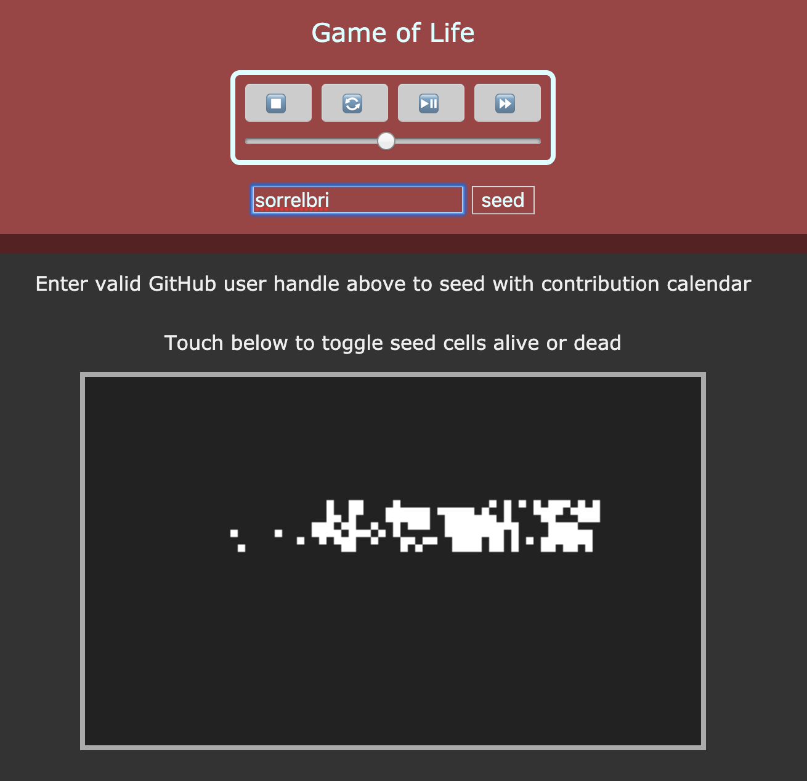
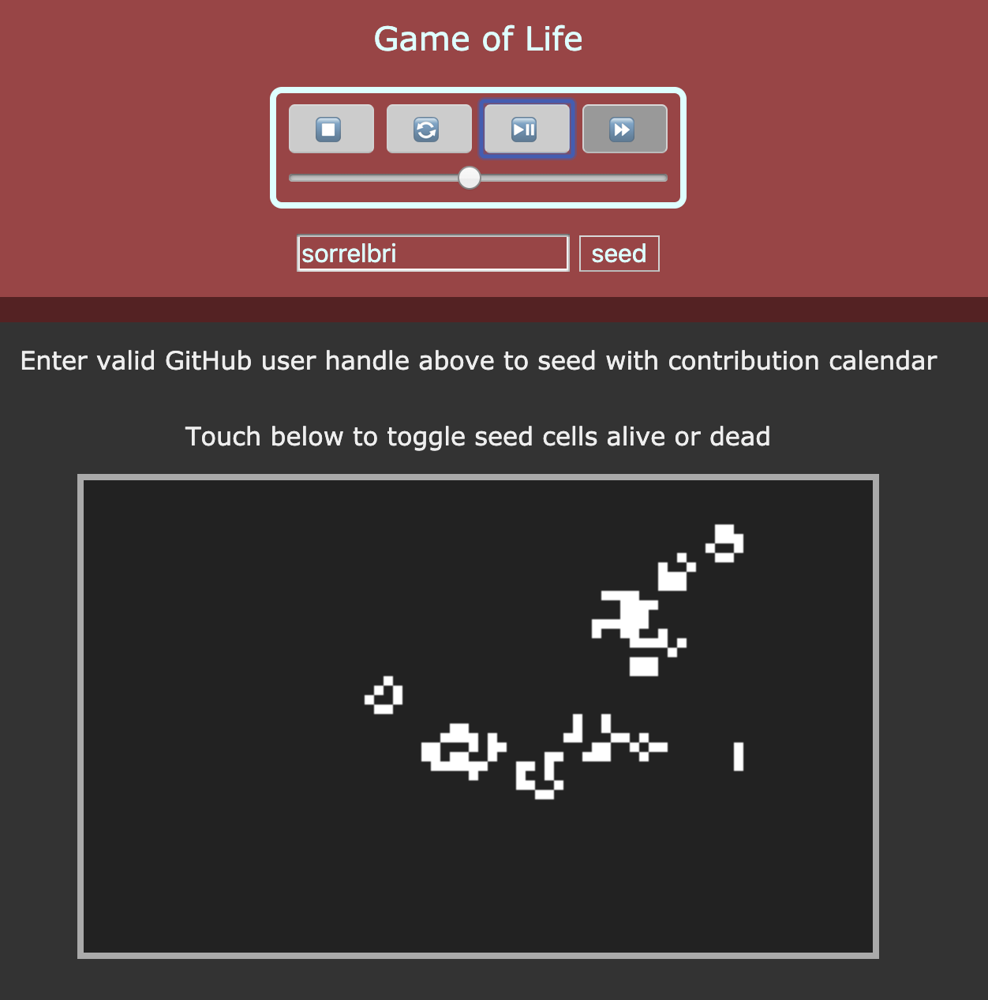

# Game of Life
*It's not really about the Game of Life*

A weekend project with the following goals:
- [x] implement webpack build with babel
- [x] develop a simple Conway's Game of Life app without framework reliance
- [x] seed Game of Life with GitHub contribution calendars just for fun
- [x] implement a GitHub Actions workflow

